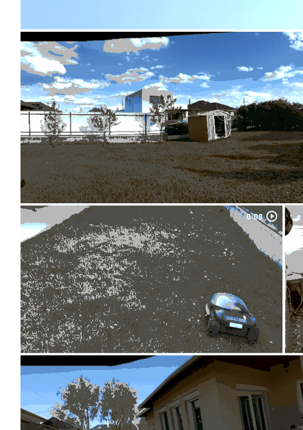
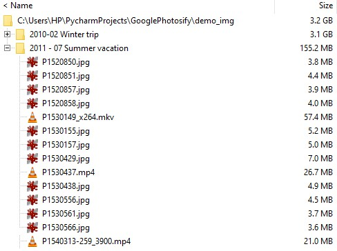
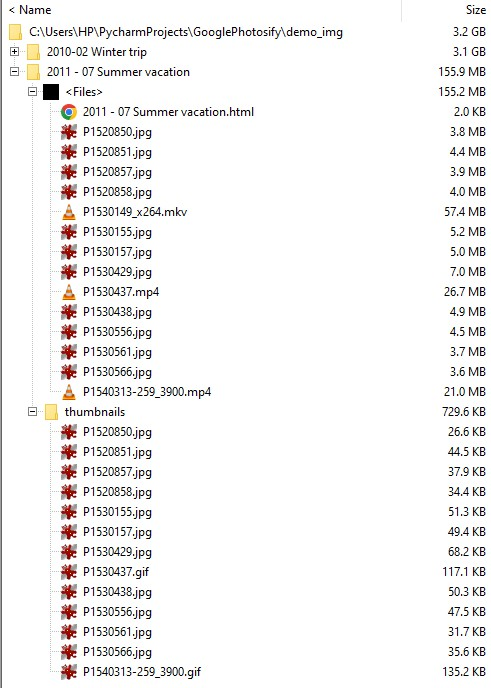

# googlephotosifyer

## 1. Plot
I was looking for the video, when our 1 year old imitates the sound of a bee. I knew where I took the video, but the video was lost among hundreds of other videos. I tried but I could not locate it easily.

## 2. Introduction
I liked Google Photos a lot, when it was a service for infinite number of images and videos. That era is gone and I stopped using Google Photos. I have my photos organized into descriptive folders anyway, but I had one good feature missing: 
When you moved the mouse over a video, it let you peek in. So when you were looking for a video, it was much easier to find than having only the firs frame displayed. 

I wondered, if I could get done something similar with creating the images into webpages, where images are displayed as thumbnails and videos like gifs. 

## 3. My own GooglePhotos
The result is exactly what I planned for. I collected some images and videos from a vacation into two folders to demonstration:

## 4. How it works
This script takes selected image folder processes them recursively and when it reached the bottom where it finds images and videos it processes them. From images a simple thumbnail is created. From videos it takes 10 frames evenly distributed across its span and a gif is created. For each folder a webpage is created, which has the folder name as a title and then all the thumbnails referenced to the original image.

### 4.1 Created files for demonstration
Before execution the two folders' content was: 

After the script finished running: 

 
### 4.2 How it works in detail
First I worked on extracting the frames from videos. For that I used cv2. Then I used the cv2 library for image thumbnail creation too. I found that for some types of images cv2 failed to work, so I moved the cv2 method into a try and in except I used PIL. I tried with 10 frames with 4 fps gifs. I randomly came up with these values, but after some trials I found that this gives a good balance between small gif sizes while giving a good insight into video content. Definitely better than a first frame as a thumbnail! 

## 5 Use
This page is purely for demonstration purposes. Use at your own risk and as you wish. 

Attila Czibere, 
2024-04
